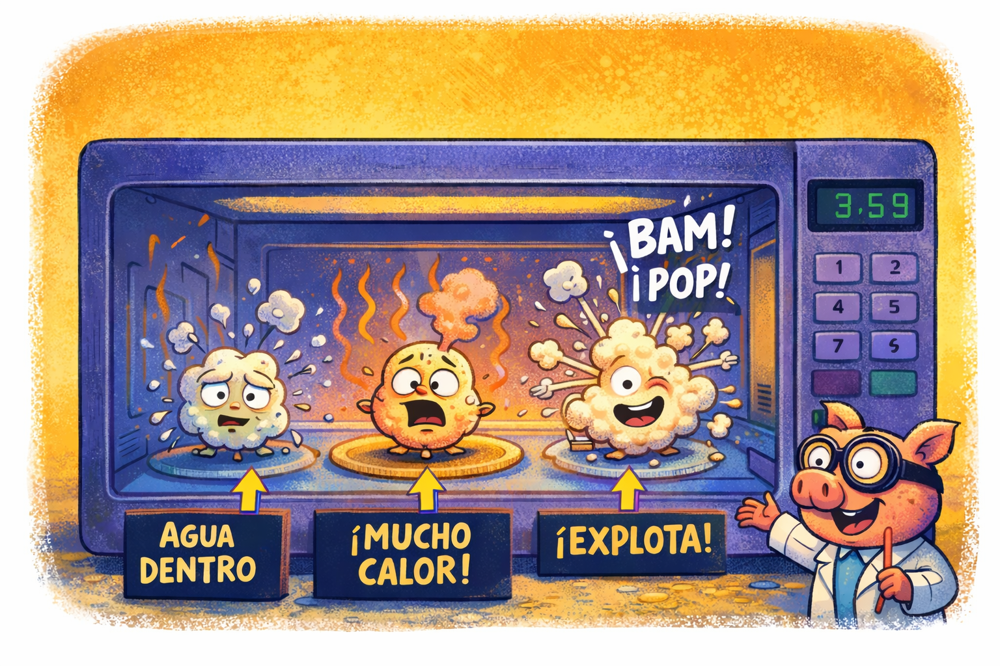

[TOC]

## Resumen

Seguramente alguna vez te has dipuesto a ver esa peli que de la que tanto hablan y para amenizar la jornada te has preparado un buen cubo de palomitas de maiz o has ido al cine y por el mismo motivo te has comprado un buen cubo de estas, en cualquier caso, como se que eres alguien muy curioso, o de que otra manera estarias aqui, te has preguntado, como rayo se hacen las palomitas, porque parecen explotar y porque saben tan ricas cuando el grano de maiza asi solo no sabe nada bien, ademas porque adopta esa forma tan curiosa que tiene. Bueno curioso amigo justo para esto ha surgido este blog asi, que preparate un buen paquete de palomitas y acomodate que te explico un poco de la ciencia destras de estes curioso fenomeno.

---

## Estructura del grano

Empesemos por el protoganista de este fenomeno el grano de maiz (*Zea mays everta*), cada uno de estos puede ser dividido en tres partes principales: (1) El endospermo, que contiene almidón y un poco de agua ($w \approx 13\text{–}15\,\%$ de su masa). (2) El pericarpio, una cáscara muy dura e impermeable. (3) El germen, no no ese tipo de germen, es simplemente la parte viva de la semilla. El secreto está en esa pequeña cantidad de agua atrapada dentro. Cuando se calienta, genera vapor y presión hasta que la cáscara no puede resistir más y explota. Buenos si querias la version corta dejalo aqui, pero si sigues curioso dejame continuar.

---

## Interacción con el microondas

El horno microondas opera típicamente a una frecuencia de 2.45 GHz, correspondiente a una longitud de onda de 12.2 cm.  
Esta radiación electromagnética interactúa con los dipolos eléctricos del agua mediante el proceso de *calentamiento dieléctrico*.  
Las moléculas de agua rotan en fase con el campo alterno, generando disipación térmica a escala molecular.

El flujo de calor neto puede describirse de forma simplificada mediante la ecuación de difusión del calor:

$$
\rho c_p \frac{\partial T}{\partial t} = k \nabla^2 T + Q_{\text{abs}}
$$

donde $\rho$ es la densidad, $c_p$ el calor específico, $k$ la conductividad térmica y $Q_{\text{abs}}$ la potencia volumétrica absorbida del campo electromagnético.

---

## Presurización interna

Al subir la temperatura, el agua dentro del grano se convierte en vapor y aumenta la presión interna como estudiante de doctorado a final de su etapa (comentario inecesario quizas pero al fin y al cabo este blog cumple tambien la funcion  entretenerme).
En Cualquier caso, esa presión depende de la temperatura según la ecuación de Clausius–Clapeyron (si lo se complicado de pronunciar sobre todo el señor Clapeyron):

$$
\frac{dP_v}{dT} = \frac{L P_v}{R T^2}
$$

cuya integración da lugar a:

$$
\ln \left( \frac{P_v}{P_0} \right) = - \frac{L}{R} \left( \frac{1}{T} - \frac{1}{T_0} \right)
$$

donde $L = 2.26\times10^6~\text{J/kg}$ es el calor latente de vaporización del agua y $R = 8.31~\text{J/mol·K}$ la constante de los gases ideales. Sustituyendo $T_0 = 373~\text{K}$, $P_0 = 1~\text{atm}$ y $T = 453~\text{K}$ (≈ 180 °C), se obtiene:

$$
P_v(453~\text{K}) \approx 9~\text{atm}
$$

valor que coincide con la presión crítica de ruptura observada experimentalmente para el pericarpio. 

---

## Explosión y expansión adiabática

Una vez que la presión interna excede la resistencia del pericarpio $( P_{\text{rupt}} \sim 9\text{–}10~\text{atm})$, se produce una fractura súbita.  
El vapor se expande rápidamente, realizando trabajo sobre el almidón circundante y provocando una expansión casi adiabática del gas.

Si suponemos una expansión adiabática reversible para el vapor de agua:

$$
P V^{\gamma} = \text{constante}
$$

donde $\gamma = c_p/c_v \approx 1.33$ para el vapor, el trabajo realizado por el gas durante la expansión es:

$$
W = \frac{P_i V_i - P_f V_f}{\gamma - 1}
$$

Tomando $P_i = 9~\text{atm}$, $P_f = 1~\text{atm}$ y considerando que el volumen final del gas es unas $V_f/V_i \approx 10$ veces mayor, se obtiene un trabajo del orden de:

$$
W \sim 10^{-3}~\text{J}
$$

A pesar de parecer pequeño, este trabajo se distribuye en escalas microscópicas, generando velocidades de expansión del orden de varios metros por segundo, suficientes para inflar el almidón y solidificarlo instantáneamente por enfriamiento.

---

## Energía total liberada

El contenido energético total asociado al cambio de fase del agua en un solo grano es:

$$
E = m L
$$

donde $m$ es la masa de agua. Si $m \approx 10^{-5}~\text{kg}$ , entonces:

$$
E = 2.26 \times 10^{6} \times 10^{-5} = 22.6~\text{J}
$$

Solo una pequeña fracción de esta energía se convierte en trabajo mecánico y sonido; el resto se disipa en forma de calor y energía interna del vapor.

---

## Factores que impiden el estallido

Los granos que no revientan (*“old maids”*) presentan:

- Bajo contenido de humedad $w < 10\,\%$, insuficiente para generar la presión crítica.  
- Fisuras microscópicas en el pericarpio, que permiten la fuga de vapor antes de alcanzar $P_{\text{rupt}}$.  
- Distribución térmica no uniforme, que evita una presurización homogénea.

---

## Eficiencia termodinámica aproximada

Si un horno microondas de potencia $P = 800~\text{W}$ opera durante $t = 120~\text{s}$:

$$
E_{\text{in}} = P t = 9.6 \times 10^{4}~\text{J}
$$

Una bolsa de 100 g contiene aproximadamente $N = 3000$ granos.  
Si cada uno libera ≈ 20 J en el proceso de vaporización:

$$
E_{\text{total}} = N \times 20~\text{J} = 6.0 \times 10^{4}~\text{J}
$$

Por tanto, la eficiencia energética del proceso es:

$$
\eta = \frac{E_{\text{total}}}{E_{\text{in}}} \approx 0.6
$$

es decir, un rendimiento del 60 %, notablemente alto para un proceso de cocción doméstico basado en calentamiento dieléctrico.

---

## Conclusiones

El estallido de las palomitas es un ejemplo fascinante de cómo principios de la física macroscópica —transferencia de calor, termodinámica de fases, elasticidad de materiales y dinámica de gases— se manifiestan en un fenómeno cotidiano.  
Cada grano actúa como una *microcápsula de presión* donde el agua, confinada, pasa de líquido a vapor hasta romper la envoltura.  
El resultado visible —la expansión blanca del almidón— es consecuencia directa de un proceso adiabático impulsado por energía térmica electromagnética.

---

